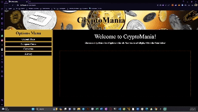

# Web Development Project: API Integration Showcase

## Project Overview

This project is a collaborative effort by our web development team to create a dynamic and interactive website. The primary focus is on showcasing our ability to integrate and utilize various browser and third-party APIs, demonstrating a wide range of functionalities and interactive features.

## Live Preview

You can view a live preview of the application [here](https://hokage-216.github.io/the-A-team/)

### Key Features

- **Real-time Data Display**: Utilizing third-party APIs to fetch and display real-time data.

## Team Contributions

### LeVente Berry

- Utilized browser local storage to store users history.
- Assisted with CSS and base HTML

### Joshua Schulz

- Implemented current price functionality with JavaScript
- Assisted with CSS layout

### Matthew Cook

- Collaborated on the base HTML and CSS
- Created the functionality to compare two coins including Price, MarketCap, Volume in. 24 hours, and the low in 24 hours
- Assisted in setting up the fetch data from the CompareCrypto API

### Zade Darwish 

- Implemented currency conversion functionality
- Assisted with base HTML and CSS layout

## Technologies Used

- **Frontend**: HTML5, CSS3, JavaScript
- **APIs**: Crypto Compare, JQueryUI/JQuery, DayJS 
- **Version Control**: Git and GitHub

